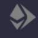
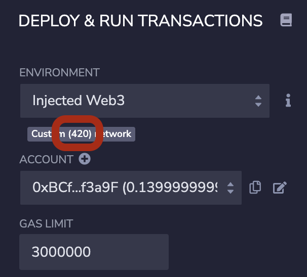
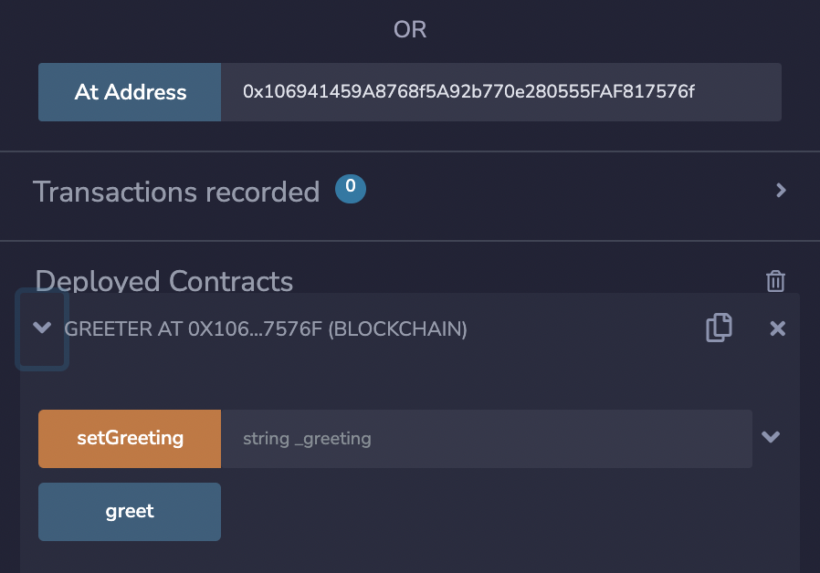
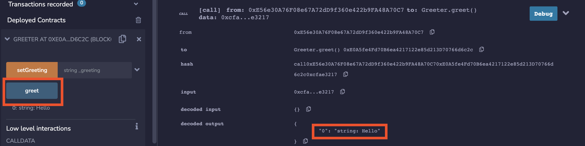
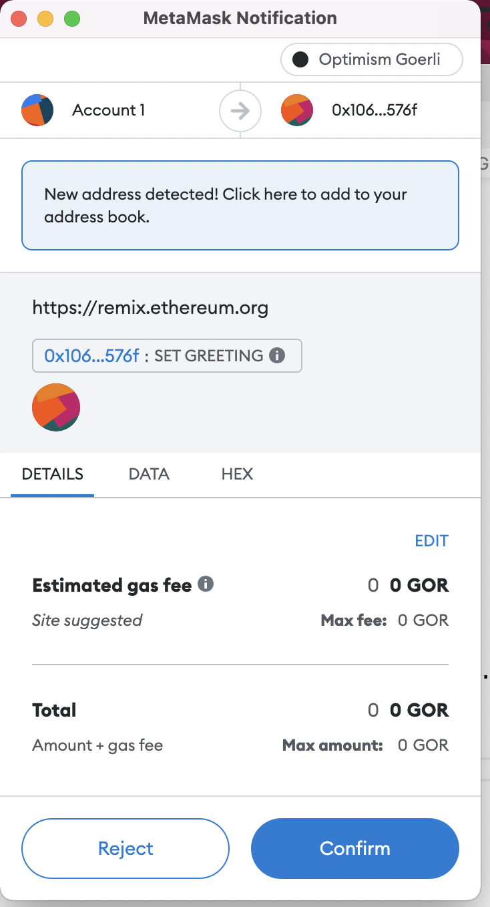

<Section name="1. Introduction" description="Introduction to Optimism">

## 1. Introduction
  
The [Optimism Collective](https://app.optimism.io/announcement) is a band of companies, communities, and citizens working together to reward public goods and build a sustainable future for Ethereum.

Together we will dispel the myth that public goods cannot be profitable. 
Public goods (such as Optimism and Ethereum) often go underfunded when incentives aren't properly aligned, forcing many to make trade-offs between earning a profit and building for the common good. 
We are bound by a mutually beneficial pact, [our vision](https://www.optimism.io/vision) can be summed up with the equation **Impact = Profit**.
[You can read more about who we are and what we are doing here](https://community.optimism.io/docs/governance/#impact-profit).

We intend to achieve this vision through retroactive public goods funding, funding for public goods that have already proven their usefulness and impact.
Retroactive public goods funding is advantageous because it is relatively easy to agree on what *is* useful, and see who built it. 
It is a lot harder to identify in advance what *will be* useful, and *which team* will do the best job of building it. 
The possibility of an eventual exit payment can also encourage investors to fund initial public good development efforts until the usefulness is obvious, in the same way that the possibility of an eventual IPO or buy out encourages investors to fund startups today.

Whether you are interested in exploring novel forms of human coordination via decentralized governance, re-aligning monetary incentives to be positive-sum for humanity through retroactive funding, creating novel dApps that were not possible before, or growing Ethereum technically and philosophically, The Optimism Collective has room for you.
We could use your help, and if you make valuable contributions we'll be happy to see they are properly rewarded.
  
Come explore the rest of the guide and dive into the rabbit-hole of possibilities and cement yourself as a part of a community that moves steadfast in furthering the power of Optimism, Ethereum and the Open Internet. 
Together, we will create the future of coordinated, collaborative cyberspace. 
Together, we will summon [Ether’s Phoenix](https://optimism.mirror.xyz/x4LGFwa6RJ_opOaCOwr_VGk04Lp3of41H8ynWaFB27E).
 
  
<Quiz id={"opt01"} />

What kind of goods is The Optimism Collective trying to encourage?
  
Private goods
Privacy-preserving goods
Public goods [✅]
Impactful goods

<Quiz id={"opt02"} />

When is the best time to identify the impact of a project?
  
The design phase
Once there is a prototype
As soon as it is deployed
After it is already in use [✅]
    
  
</Section>

<Section name="2. How It Works" description="What are optimistic rollups, and how Optimism offers Ethereum-level security at a fraction of the cost">
  
## 2. How It Works
  
[Ethereum has limited capacity](https://ethereum.org/en/layer-2/) because of the [blockchain trilemma](https://medium.com/certik/the-blockchain-trilemma-decentralized-scalable-and-secure-e9d8c41a87b3). 
To have decentralization we need to enable as many people as possible to run a node, which means that the number of transactions that can be processed per minute is limited by the capacity of standard hardware. 
This limits our ability to scale, unless we accept the security implication of not having every node process every transaction.

Solutions that build on top on Ethereum are called layer 2 or L2 (with Ethereum itself called layer 1 or L1). 
Optimism uses a type of solution called an [optimistic rollup](https://ethereum.org/en/developers/docs/scaling/optimistic-rollups/).
*Rollups* post all transactions on layer 1, so data integrity and availability are provided by Ethereum. 
 
*Optimistic Rollups* use economic incentives to ensure the data processing, done offchain, is done correctly. 
The *sequencer* node posts the merkle root of the blockchain state on L1 (called the *state root*).
Other nodes, called *verifiers*, can issue *fault challenges* if they believe the state root is incorrect.
In the case of a fault challenge part of the transaction is executed on L1 to verify which is the correct state root.
  
Sequencers that post correct state roots, and verifiers that challenge incorrect ones, are rewarded for their honesty.
Sequencers that post incorrest state roots are penalized for dishonesty.
Verifiers that challenge correct results, which could be used as a denial of service attack, are penalized.
If a state is not challenged for the challenge period (seven days on the production network), it is assumed to be correct. 
As long as there is at least one honest verifier, the state will end up being the correct one - and the economic incentives are aligned with honesty. 
  
[We have a bridge](https://app.optimism.io/bridge) that allows users to deposit into Optimism and withdraw from it using this mechanism.
A withdrawal requires you to waiting the challenge period (until the blockchain state becomes indisputable), but faster withdrawals are available from [third party bridges](https://www.optimism.io/apps/bridges) that run their own verifiers so they **know** the state submitted is correct. 
 
[For a video explanation that goes deeper into the details of how Optimism works, see here](https://www.youtube.com/watch?v=f4YkMj3Vijs).
  
  
<Quiz id={"opt03"} />

Which of these attributes is *not* part of the blockchain trilemma?
  
Security
Decentralization
Privacy [✅]
Scalability  
  
  
<Quiz id={"opt04"} />

What mechanism does Optimism use to ensure data availability?
  
Economic incentives
Mathematics (specifically, zero knowledge proofs)
Mathematics (specifically, cryptographic hash functions)
Reliance on L1 Ethereum  [✅]

  
  
<Quiz id={"opt05"} />

What mechanism does Optimism use to ensure posted state roots are correct?
  
Economic incentives  [✅]  
Mathematics (specifically, zero knowledge proofs)
Mathematics (specifically, cryptographic hash functions)
Reliance on L1 Ethereum  
  
  
  
### Path to decentralization

Currently Optimism is running the sole sequencer because we don't have the fault challenges running yet.
However, there are already many verifiers watching us to make sure this power is not abused.
[We are working hard at decentralization](https://medium.com/ethereum-optimism/our-pragmatic-path-to-decentralization-cb5805ca43c1).

1. Release Bedrock, enabling a multi-client architecture
2. Support (directly or indirectly) the creation of alternative Optimism clients
3. Ship the multi-client proof contracts
4. Either renounce the power to upgrade the contracts further, or transfer it to [the most trusted address in Ethereum](https://etherscan.io/address/0x0000000000000000000000000000000000000000).
  
</Section>

<Section name="3. Using Optimism" description="A simple exercise to use the Optimism network">  
  
## 3. Using Optimism
  

You can follow these directions to see how easy it is to use Optimism from [the Remix IDE](https://remix.ethereum.org/). 
If you prefer to use a different development stack, [follow the steps in this exercise](https://github.com/ethereum-optimism/optimism-tutorial/tree/main/getting-started).
We're [EVM-equivalent](https://medium.com/ethereum-optimism/introducing-evm-equivalence-5c2021deb306), so whatever method you are comfortable using in L1 Ethereum we support.
  
1. Add Optimism Goerli to your wallet, using [this link](https://chainid.link/?network=optimism-goerli).

1. Log on with your wallet to Optimism Goerli.

1. Browse to [Remix](https://remix.ethereum.org/).
1. Click the run icon ().
1. Select the Environment **Injected Web3 Provider**.
1. Accept the connection in the wallet.

### Greeter interaction

1. Click the run icon ().

1. Make sure your environment is **Injected Web3** and the network ID is **420**.

   

1. Click the files icon ().

1. Download [Greeter.sol](contracts/Greeter.sol) and upload () it to Remix under **contracts**.

1. Right-click **contracts > Greeter.sol** and select **Compile**.

1. Open **contracts > artifacts** and see that there's a `Greeter.json` file. This file is the compiled version, the API for the contract, etc.

1. Click the run icon ().

   If you do not have Goerli ETH, get some using [our faucet](https://optimismfaucet.xyz/).
   You just need to follow five people or projects on github.

1. Scroll down. 
   In the At Address field, type the contract address (`0x106941459A8768f5A92b770e280555FAF817576f`).
   Then, click **At Address**. 
   Expand the contract to see you can interact with it.

   

1. Click **greet** and expand the transaction result in the console (bottom right).

   

1. Type a greeting and then click **setGreeting**. Approve the transaction in your wallet. 
   Note that if the greeting includes a comma you need to enclose it in quotes.

   

1. See the results on the console and then click **greet** again to see the greeting changed.   

</Section>

<Section name="4. What Else?" description="Other things you can do on Optimism">  

## 4. What Else?  
  
### NFTs
  
See [Quix, our biggest NFT marketplace](https://qx.app/).

The best way to deploy an NFT Collection on Optimism is to use [thirdweb](https://thirdweb.com/).

Follow the steps below to deploy an ERC721 NFT Collection and create a web3 minting interface like this one:

<video src='https://blog.thirdweb.com/content/media/2022/11/2022-11-02-15-45-44.mp4' width='100%' height='100%' controls></video>

Go to the [thirdweb dashboard](https://thirdweb.com/dashboard) and click on "Deploy new contract".


From the pre-built contracts, select the NFT Drop contract:


Click `Deploy Now`:


Here, you'll be taken to the page to populate the metadata of the NFT Drop contract you're going to deploy. Set up your smart contract with an image, name, description, etc., and configure which wallet address will receive the funds from primary and secondary sales:


Ensure you select `Optimism (ETH)` if you want to deploy to mainnet, or `Optimism (Goerli)` if you want to use test funds. When you're ready, click Deploy Now!


This will deploy your [NFT Drop](https://portal.thirdweb.com/contracts/DropERC721) smart contract to the Optimism network.

Let's see what we can do with it!

<br/>

**Set Up Claim Conditions**

Claim conditions are the criteria that define who, when, and how users can claim an NFT from your drop; such as release dates, allowlists, and claim limits.

To add a claim phase, head to the `Claim Conditions` tab and click `Add Initial Claim Phase`:


Here, you can configure the price, release date, and more for your NFT drop:


Update the details as you want and save the claim phase!

<br/>

**Lazy-Minting NFTs**

Now our claim phases are set up, let's batch-upload some NFTs for the users to mint from our drop under those conditions.

[Lazy minting](https://portal.thirdweb.com/pre-built-contracts/nft-drop#lazy-minting-nfts) is the process of uploading the metadata for your NFT(s) without minting them yet. We're going to lazy-mint the metadata for our NFTs so that other people can mint them!

For this guide, I am going to use the metadata from our [Shapes batch upload example](https://github.com/saminacodes/tw-demo-assets/tree/main/Shapes).

To batch upload and lazy mint your metadata, head to the `NFTs` tab and click on the `Batch Upload` button:


Drag and drop your images along with your metadata file(s) into the upload area:


Here, you'll be able to preview your NFTs before lazy-minting them:


When you're ready, click `Next`!


Finally, click `Upload X NFTs` and approve the `Lazy Mint` transaction.

In the background, your metadata is being uploaded and pinned to IPFS, meaning your metadata is immutable and decentralized. Once the transaction goes through, your NFTs are ready to be minted!

Let's see how you can claim/mint the NFTs from the drop now.

<br/>

**Claiming NFTs from the Dashboard**

From the NFTs tab, you can click the Claim button to mint NFTs from your drop directly through the dashboard:


Enter the wallet address and quantity you wish to mint to, and click `Claim NFT`:


That's it! You've just minted the first NFT from the drop:


Let's explore how we can create a web3 application on top of our smart contract to allow users to connect their wallets and mint NFTs now.

<br/>

**Creating a Web3 Application**

To get started, head to your terminal and create a new Next.js application with the thirdweb SDK pre-configured:

```bash
npx thirdweb@latest create --app --next --js
```

First, head to the `pages/_app.js` file and configure your network to be Optimism:

```jsx
// This is the chainId your dApp will work on.
// Use "Optimism" for mainnet or "OptimismGoerli" for testnet.
const activeChainId = ChainId.OptimismGoerli;
```

Let's create a simple application that users can mint from, like this:


Head to the homepage (`pages/index.js`). First, we'll use the [`useContract`](https://portal.thirdweb.com/react/react.usecontract) hook to connect to our smart contract using its address (which you can get from the dashboard):

```jsx
const { contract: nftDrop } = useContract("YOUR_DROP_ADDRESS");
```

To get the metadata of our smart contract, we will use the [`useContractMetadata`](https://portal.thirdweb.com/react/react.usecontractmetadata) hook like this:

```jsx
const { data: contractMetadata, isLoading } = useContractMetadata(nftDrop);
```

Then, we'll create a simple UI to render the image using the MediaRenderer component, the name of our smart contract, and use the Web3Button to allow users to connect their wallet and mint NFTs from our drop using the claim function:

```jsx
import {
  MediaRenderer,
  useContract,
  useContractMetadata,
  Web3Button,
} from "@thirdweb-dev/react";
import styles from "../styles/Home.module.css";

const Home = () => {
  const { contract: nftDrop } = useContract("YOUR_DROP_ADDRESS");
  const { data: contractMetadata, isLoading } = useContractMetadata(nftDrop);

  if (isLoading) {
    return <div className={styles.container}>Loading...</div>;
  }

  return (
    <div className={styles.container}>
      <MediaRenderer
        src={contractMetadata.image}
        alt={contractMetadata.name}
        style={{
          width: "200px",
        }}
      />

      <p>{contractMetadata.name}</p>

      <Web3Button
        contractAddress={"YOUR_DROP_ADDRESS"}
        action={(contract) => contract.erc721.claim(1)}
        onSuccess={() => alert("Claimed!")}
        onError={(error) => alert(error.message)}
      >
        Claim NFT
      </Web3Button>
    </div>
  );
};

export default Home;
```

> Remember to replace `"YOUR_DROP_ADDRESS"` with your smart contract address.

From the terminal, run the `npm run dev` command and visit `localhost:3000` to preview your app.        
 
### Launching a token
  
A token is just another contract, which is easy to deploy. 
If you already have an ERC-20 contract on L1, and you wish to deploy to have a bridgeable equivalent on Optimism, [we have directions to help you](https://github.com/ethereum-optimism/optimism-tutorial/tree/main/standard-bridge-standard-token).
  

<Quiz id={"opt06"} />

What is the name of the biggest NFT marketplace on Optimism?
  
OpenOcean
Quix  [✅]  
Cervantes
Hidalgo
  
</Section>

<Section name="5. Getting Involved" description="Ways to get involved with Optimism">   
  
## 5. Getting Involved  
  
Welcome to Optimism.
Here is where you can go for additional information:
       
- [User docs](https://help.optimism.io/hc/en-us)
- [Developer docs](https://community.optimism.io/)
  
If you can't find the answer in the docs, or you want to talk with real people (Optimism Foundation, OP Labs PBC, or anybody else in our ecosystem), use our Discord:
  
- [Discord](https://discord-gateway.optimism.io/)

  
What to do next?
We'd love for you to build on Optimism:
  
- [If you don't know what to build](https://web.telegram.org/k/#-1645849954)
- [If you *do* know what to build, but you'd like to discuss it with us](https://optimismpbc.typeform.com/get-in-touch)
- [If you've already built it, but want us to help you get the word out](https://optimismpbc.typeform.com/op-marketing)
  
Want to work directly with us? 
We're hiring:

- [Optimism Foundation](https://boards.greenhouse.io/optimism)
- [OP Labs PBC (the technical consultant company)](https://boards.greenhouse.io/oplabs)
    
</Section>  
  
